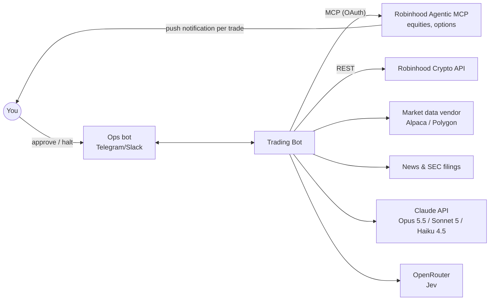
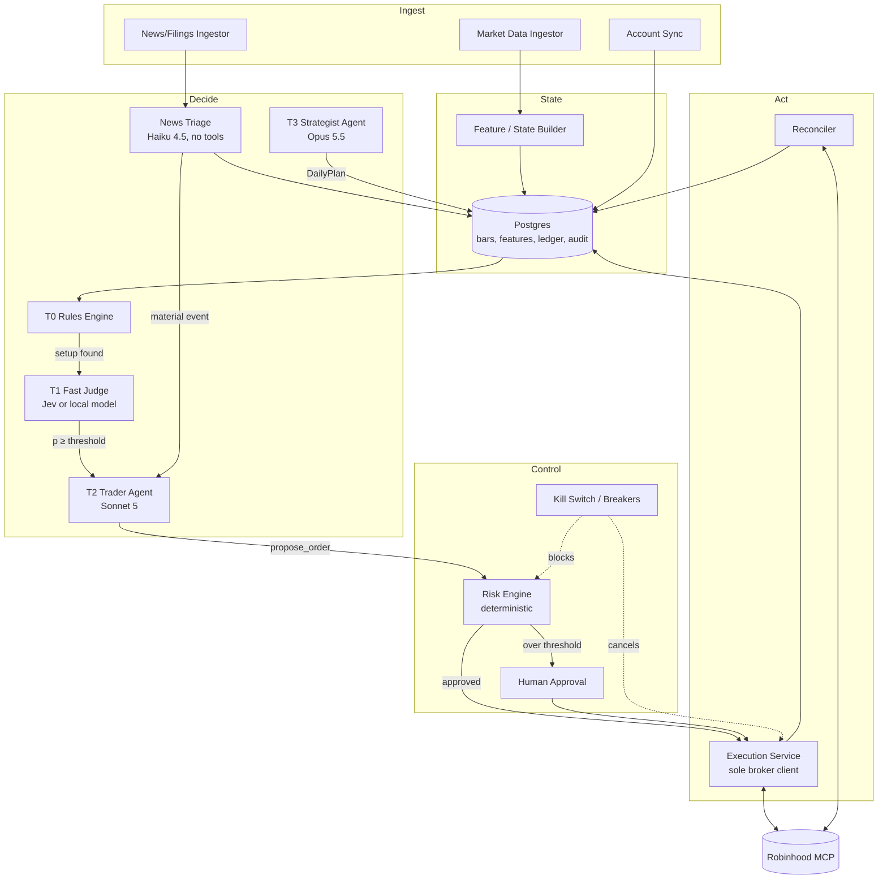
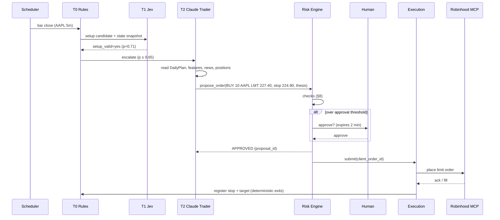

# Agentic Trading Bot: Architecture

**Claude + Jev (or an open-source judge) + Robinhood Agentic Trading**

Status: Draft v0.1 · 2026-09-28 · Design only, no code yet. See [PLAN.md](./PLAN.md) for the roadmap.

---

## 1. Goals and non-goals

**Goals**
- Agentic trading of US equities first, then options and crypto, through a **Robinhood Agentic account**.
- **Claude** handles research, planning, trade reasoning and journaling. A **fast typed-decision model** (Jev, or an open-source substitute) makes the per-bar judgments. **Deterministic code** does the math, risk checks and execution.
- The same strategy code runs in backtest, paper and live.
- Every decision can be audited and replayed.

**Non-goals**
- HFT or anything below one second, and market making.
- Managing other people's money.
- Running fully unattended from day one (humans stay in the loop at first).

## 2. Core principles

1. **LLMs judge, code enforces.** No model can place an order directly. Every order passes a deterministic **Risk Gate**.
2. **Defense in depth.** Four layers: the broker's funded-budget ceiling (the Robinhood agentic sub-account), our risk engine, human approval thresholds, and a kill switch.
3. **Tiered intelligence.** Each cadence uses the cheapest decider that is good enough (rules, then Jev, then Sonnet, then Opus).
4. **External text is untrusted.** News, filings and social posts are data, never instructions (prompt-injection containment).
5. **Reproducible.** Every model call is logged with its inputs and outputs, and a decision cache allows exact replay.
6. **Fail closed.** Any error, stale data or ambiguity means no trade.

## 3. Technology choices

| Concern | Choice | Why | Alternatives |
|---|---|---|---|
| Runtime | Python 3.12, `uv`, asyncio | Quant ecosystem; used by existing Jev bots | none |
| Reasoning agents | Claude through the Anthropic Python SDK **Tool Runner** (custom tools only) | Small, auditable tool surface; structured outputs; prompt caching | Claude Agent SDK (see §7.4) |
| Strategist model | `claude-opus-5-5` | Deep daily/weekly reasoning | `claude-opus-5` |
| Trader model | `claude-sonnet-5` | Good judgment at about half the Opus price | none |
| News triage | `claude-haiku-4-5` | Cheap, fast structured extraction | none |
| Fast judge (T1) | **Jev** (`typesafe/jev-1.13` on OpenRouter) behind a `DecisionProvider` interface | Typed Choice/Score/Noul answers with calibrated probabilities; $0.042 per 1M input tokens, output free; 32K context | See §3.1 |
| Broker: equities/options | **Robinhood Agentic Trading MCP** `https://agent.robinhood.com/mcp/trading` | Official. The agent can spend only its separately funded budget | `robin_stocks` (unofficial, **avoid**: violates the terms of service and risks an account lock) |
| Broker: crypto | Robinhood Crypto Trading API (official REST), until crypto is fully available on the MCP | Official | none |
| Market data | Alpaca Market Data (or Polygon) | The Robinhood MCP is not a data feed | `yfinance` (research only) |
| Paper broker | Alpaca paper trading | Robinhood has no paper mode | Internal simulator |
| Research/backtest | `vectorbt` plus an in-house event-driven replay that reuses the live code | Fast parameter sweeps, and live/backtest parity | See §3.2 |
| Indicators | `pandas-ta` / TA-Lib | Standard | none |
| Storage | Postgres (+ TimescaleDB for bars); SQLite in dev | Ledger, audit and time series in one place | none |
| Scheduling | APScheduler + `exchange_calendars` | Aware of market hours and holidays | none |
| Ops/alerts | structlog, Grafana, Telegram/Slack bot | Approvals, alerts, `/halt` | Email |
| Deploy | Docker Compose on a small VM | Simple; single tenant | none |

### 3.1 Fast judge: Jev vs open-source options

Jev is **not open source**. It is TypeSafe's hosted decision model, released 2026-09-15. Its customer terms forbid publishing performance benchmarks or training surrogate models on its outputs. That is why it sits behind a swappable interface.

| Option | Type | License | Best use |
|---|---|---|---|
| **Jev** (TypeSafe) | Hosted typed-decision model | Proprietary | Cheap per-bar typed questions ("is this breakout valid?") with probabilities |
| **Claude Haiku 4.5** + structured output | Hosted LLM | API | Drop-in fallback for Jev; slower and costlier per call |
| **Qlib** (Microsoft) | Open-source quant/ML platform | MIT | Train your own local classifier or alpha model. Free and fast at runtime |
| **LightGBM on engineered features** | Open-source ML | MIT | Simplest local T1 baseline; always build it for comparison |
| **TradingAgents** (TauricResearch) | Open-source multi-agent LLM framework | Apache-2.0 | Pattern for T3 research/debate, not per-bar decisions |
| **FinRL** | Open-source deep RL | MIT | Experimental; later |

**Recommendation:** implement `JevProvider` and `LocalModelProvider` (LightGBM/Qlib) from the start, plus `HaikuProvider` as a fallback. Pick by measured calibration (Brier score) and P&L in paper trading.

### 3.2 Trading engine options

| Framework | License | Robinhood live adapter? | Notes |
|---|---|---|---|
| NautilusTrader | LGPL-3.0 | No (a custom adapter would be needed) | Strong event-driven backtest/live parity; heavier |
| LEAN (QuantConnect) | Apache-2.0 | No | C#-core; heavy |
| Freqtrade | GPL-3.0 | No | Crypto only (has FreqAI) |
| Jesse | MIT | No | Crypto only |
| backtrader | GPL-3.0 | No | Mature but aging |
| vectorbt | Apache-2.0 + Commons Clause | n/a | Vectorized research, not live |

**Recommendation:** no framework has a Robinhood adapter, and the cadence is minutes. So build a **thin custom runtime** and use **vectorbt for research**. Revisit NautilusTrader if the bot goes multi-broker.

## 4. System context



## 5. Components



| Component | Responsibility |
|---|---|
| Market Data Ingestor | Streams/polls bars and quotes for the watchlist and held symbols; checks freshness |
| News/Filings Ingestor | Pulls headlines, 8-Ks and earnings calendar; stores raw text as **untrusted** |
| Account Sync | Pulls positions, orders, buying power and the agentic budget from the broker |
| Feature/State Builder | Indicators, regime and volatility; builds compact JSON **state snapshots** for the models |
| T0 Rules Engine | Setup detection plus **all exits** (stops, targets, time-stops). Exits never wait for an LLM |
| T1 Fast Judge | Typed questions per candidate; returns probabilities; code thresholds decide escalation |
| News Triage | Haiku extracts `{symbol, event_type, sentiment, materiality}`; no tools, strict schema |
| T2 Trader Agent | Reasons over a candidate and emits a `TradeProposal` or `NoTrade` |
| T3 Strategist Agent | Pre-market plan, post-market review, weekly strategy review |
| Risk Engine | Deterministic pre-trade checks (§8). The model cannot change its config |
| Human Approval | Approve/reject buttons with expiry; required above thresholds |
| Execution Service | **Only** holder of broker credentials; order state machine; idempotency |
| Reconciler | Broker vs ledger diff every minute and on startup; a mismatch means halt |
| Kill Switch | Manual (`/halt`) or automatic (breakers): cancels open orders and blocks new ones |

## 6. Decision tiers and cadence

| Tier | Who | When | Output |
|---|---|---|---|
| **T3 Strategist** | Opus 5.5 (`effort: high`) | 08:30 ET pre-market, 16:30 ET post-market, weekly on Sunday | `DailyPlan`: regime view, watchlist (≤ 20), per-symbol thesis, allowed setups, risk dial 0–1, no-trade list |
| **T2 Trader** | Sonnet 5 (`effort: medium`) | Event-driven: T1 escalation, material news, or a position event | `TradeProposal` (through `propose_order`) or `NoTrade` with reason |
| **T1 Fast Judge** | Jev / local model | Each bar close (1–5 min), only for symbols with a T0 setup | e.g. `setup_valid: Choice{yes,no}`, `trend: Choice{up,down,range}`, `quality: Score` with probabilities |
| **T0 Rules** | Code | Every bar | Setup candidates; stop/target/time-stop exits |
| **News Triage** | Haiku 4.5 | Per news item on watchlist/held symbols | Structured event record; material events wake T2 |

### Trade lifecycle



## 7. Agent design (Claude)

### 7.1 Surface
**Anthropic Python SDK + Tool Runner**, with custom tools only. The agents don't need filesystem, shell or web tools, and a minimal tool surface is the safest.

### 7.2 Tool catalog

| Tool | Access | Strategist | Trader | Notes |
|---|---|---|---|---|
| `get_market_snapshot(symbols)` | read | ✓ | ✓ | Quotes, spread, volume |
| `get_bars(symbol, tf, lookback)` | read | ✓ | ✓ | Capped lookback |
| `get_features(symbol)` | read | ✓ | ✓ | Precomputed indicators/regime |
| `get_news_digest(symbol, since)` | read | ✓ | ✓ | **Structured** triage output only, never raw text |
| `get_positions()` / `get_risk_budget()` | read | ✓ | ✓ | Includes remaining daily loss budget |
| `ask_fast_judge(symbol, questions)` | read | ✓ | ✓ | Calls Jev/local model |
| `set_daily_plan(plan)` | write | ✓ | none | Schema-validated `DailyPlan` |
| `propose_order(spec)` | write | none | ✓ | Goes to the Risk Engine; returns `APPROVED` / `REJECTED(reasons)` / `PENDING_HUMAN` |
| `cancel_proposal(id)` | write | none | ✓ | Only its own pending proposals |
| `write_journal(entry)` | write | ✓ | ✓ | Rationale, lessons |

**Never exposed to any model:** raw `place_order`, transfers or withdrawals, account settings, or risk config.

### 7.3 Model configuration notes
- `strict: true` on every tool; structured outputs for `DailyPlan` and `TradeProposal`.
- Opus 5.5: thinking cannot be disabled, so tune `effort` instead (its default is `medium`). Forced `tool_choice` (`any`/`tool`) returns a 400, so use `auto` and name the tool in the prompt.
- **Prompt caching:** tool definitions, system prompt, hard rules and the strategy playbook go first (cached). The volatile state snapshot goes last.
- **Cost meter:** tokens and dollars are tracked per call, with a hard daily cap. When the cap is hit, the bot drops to **T0-only mode** (exits still work, no new LLM-driven entries).
- Model IDs are pinned and upgraded only after the eval suite passes.

### 7.4 Execution path: Option A (preferred) vs Option B (fallback)

- **Option A (preferred):** the Execution Service is the **only MCP client** to Robinhood, using the MCP Python SDK with OAuth. Claude never sees Robinhood tools; it only sees `propose_order`. This is the strongest isolation.
- **Option B (fallback):** use this only if Robinhood's OAuth works only with interactive clients like Claude Code/Desktop. Run the **Claude Agent SDK** headless with the Robinhood MCP attached, restrict `allowed_tools` to read and order tools, and add a **`PreToolUse` hook** that calls the Risk Engine and denies any failing call. This is weaker, because the model holds a live order tool.

Phase 0 decides which option to use (see PLAN).

## 8. Risk engine

Every check must pass. Parameters live in a versioned `config/risk.yaml`; a change needs a restart and is logged.

| Category | Rule (initial defaults) |
|---|---|
| Universe | Symbol is in today's `DailyPlan` watchlist or already held; not on the deny list; asset class enabled |
| Session | Regular trading hours only (at first); not within 5 min of open/close |
| Order type | **Limit only**; price within 20 bps of the NBBO mid; no market orders |
| Sizing | Risk per trade (stop distance × qty) ≤ 0.5% of equity; position ≤ 10%; gross exposure ≤ 60%; sector ≤ 25% |
| Options (later) | Long calls/puts and defined-risk spreads only; no naked shorts; DTE ≥ 7; premium ≤ 2% per trade; liquidity filters (OI, volume, spread) |
| Frequency | Max orders per day; per-symbol cooldown; pattern-day-trader counter for the account's applicable rules |
| Loss breakers | Daily −2% halts new entries. Weekly −5% halts until a human re-enables. Drawdown −10% triggers the **kill switch** |
| Data quality | Quote age < 5 s; features fresh; model output schema-valid; confidence ≥ threshold |
| Sanity | Symbol exists and is tradable (catches hallucinated tickers); qty > 0; no duplicate `proposal_id` |
| Human approval | Needed for the first 20 live trades, any options trade, or notional > $X |

**Kill switch triggers:** manual `/halt`, a loss breaker, a reconciliation mismatch, MCP tool-schema drift, or a missed heartbeat (dead-man switch). The switch cancels open orders and blocks new ones. Robinhood's one-tap disconnect is the last resort.

## 9. Execution and reconciliation

**Order state machine:**
`PROPOSED → RISK_APPROVED → [PENDING_HUMAN] → SUBMITTED → ACKED → PARTIAL → FILLED | CANCELED | REJECTED | EXPIRED`

- An idempotent `client_order_id` is derived from `proposal_id`. The service **never blind-retries a submit**: it queries the order's status first.
- OAuth tokens are stored encrypted, with refresh handling. Broker calls are rate-limited client-side.
- **Tool-surface pinning:** on startup the service lists the MCP tools, hashes their schemas and compares them to the pinned hash. Any drift halts trading.
- The Reconciler runs every 60 s and on startup. Unresolved mismatches trigger a halt and an alert.

## 10. Key data entities

| Entity | Key fields |
|---|---|
| `DailyPlan` | date, regime, watchlist[{symbol, thesis, setups, max_risk}], risk_dial, no_trade[], model_call_id |
| `StateSnapshot` | symbol, ts, features{}, quote{}, position{}, plan_ref |
| `JudgeDecision` | provider, question, choice/score, probability, latency, cost |
| `TradeProposal` | id, symbol, side, qty, limit, stop, target, thesis, confidence, agent, model_call_id |
| `RiskDecision` | proposal_id, verdict, failed_rules[], approver |
| `Order` / `Fill` | client_order_id, broker_id, state, qty, price, ts |
| `Position` / `LedgerEntry` | symbol, qty, avg_cost, realized/unrealized P&L |
| `ModelCall` | provider, model, prompt_version, input_hash, tokens in/out/cached, cost, latency, output |
| `JournalEntry` | ts, author (agent/human), text, tags |

## 11. Backtesting and evaluation

1. **Research:** vectorbt parameter sweeps for T0 rules.
2. **Replay:** an event-driven replay runs the **real** pipeline, with providers in replay mode, using a **decision cache** (`hash(model, prompt_version, state) → output`).
3. **Forward paper trading:** the only test the LLM tiers can't game (see the look-ahead warning below).

**LLM look-ahead bias:** Claude and Jev were trained on historical data and may "know" what happened. Backtests before a model's training cutoff are contaminated. Mitigations:
- Anonymize tickers and dates in backtest prompts.
- Score LLM tiers only on post-cutoff periods.
- Treat paper trading as the real gate.

**Baselines:** SPY buy-and-hold, and **T0-only rules**. The LLM tiers must beat T0-only **after** API costs and slippage.

**Metrics:** CAGR, Sharpe/Sortino, max drawdown, hit rate, win/loss ratio, turnover, slippage vs mid, LLM $ per trade, and T1 calibration (Brier score / reliability curve).

**Agent evals (golden scenarios):**
- Rejects a hallucinated ticker.
- Respects the no-trade list.
- Abstains on stale data.
- Doesn't follow instructions embedded in news text.
- Sizes correctly under a reduced risk dial.

## 12. Security

- **Secrets:** Anthropic, OpenRouter, data vendor and Robinhood OAuth credentials are kept in a secret store (never in prompts or logs). Only the Execution Service has broker credentials.
- **Prompt injection:** raw external text goes only to the tool-less Haiku extractor. Downstream agents see only schema-validated fields.
- **Least privilege:** each service gets its own credentials and an egress allowlist.
- **Audit log:** append-only; every model call, proposal, risk verdict and order is linked by IDs.

## 13. Deployment

Docker Compose services:
- `orchestrator`: scheduler and agents
- `ingest`
- `execution`
- `postgres`
- `grafana`
- `ops-bot`: Telegram/Slack

All run on one small VM. The orchestrator sends a heartbeat to the execution service. If the heartbeat is missed, execution blocks new orders and exits keep running.

## 14. Proposed repo layout

```text
trading-bot/
├── pyproject.toml
├── config/            risk.yaml, strategy.yaml, prompts/ (versioned)
├── src/tradebot/
│   ├── domain/        types, enums, state machine
│   ├── data/          ingestors, feature builder, calendar
│   ├── decide/
│   │   ├── rules/     T0 setups + exits
│   │   ├── providers/ jev.py, local_model.py, haiku.py  (DecisionProvider)
│   │   └── agents/    strategist, trader, news_triage, tools
│   ├── risk/          engine, rules, breakers, kill switch
│   ├── execution/     robinhood_mcp, robinhood_crypto, alpaca_paper, simulator
│   ├── ledger/        positions, P&L, reconciler
│   ├── backtest/      replay harness, decision cache, reports
│   └── ops/           alerts, approvals bot, dashboard
└── tests/             unit, property (risk), chaos (execution), agent evals
```

## 15. Cost envelope (rough, list prices as of mid-2026)

Assumes 20 watchlist symbols, 5-minute bars, and about 20 T2 escalations per day.

| Item | Est. per trading day |
|---|---|
| Jev: about 1.5K calls × 2K input tokens | ~$0.15 |
| Sonnet 5 trader: 20 calls × ~20K in / 2K out ($2 / $10 per MTok) | ~$1.20 before caching |
| Opus 5.5 strategist: 2 runs × ~100K in / 10K out ($4 / $20 per MTok) | ~$1.20 |
| Haiku 4.5 news: about 200 items × 2K in / 300 out ($1 / $5 per MTok) | ~$0.70 |
| **Total** | **~$3–5/day (~$60–100/month)** + data vendor |

> ⚠️ **Hurdle rate:** on a $1,000 account, $80/month of LLM spend is an 8% **monthly** hurdle. Start with T0 + T1 plus a once-a-day T3 run, and enable T2 only when the paper results justify it.

## 16. Risks and open questions

1. **Robinhood MCP details:** the exact tools, order types (are stops supported?), rate limits, and whether non-interactive clients can complete OAuth. This decides Option A vs B.
2. **Jev:** new and proprietary, with restrictive terms. Keep it swappable and never publish its benchmark results.
3. **Edge is unproven.** Expect the rules baseline to be hard to beat; the design makes this measurable.
4. **Regulatory/tax:** pattern-day-trader rules, wash sales, options approval level. This is personal automation, not investment advice.
5. **Model/API drift:** pin versions and gate upgrades on evals.
6. **LLM cost vs account size** (§15).

## Sources
- [Robinhood: Agentic Trading overview](https://robinhood.com/us/en/support/articles/agentic-trading-overview/)
- [Robinhood: Robinhood is now open to agents](https://robinhood.com/us/en/newsroom/robinhood-is-now-open-to-agents/)
- [SecProve: Connect Claude to Robinhood Agentic Trading](https://secprove.com/trading-agent-safety/connect-claude)
- [OpenRouter: Jev 1.13](https://openrouter.ai/typesafe/jev-1.13) · [What is Jev?](https://openrouter.ai/blog/insights/what-is-jev/)
- [Survey of Jev finance/trading projects](https://gist.github.com/drillan/6916b16e8ea31a8ec36c8f59d6483150)
- Reference Jev bots: [tyleree/jevbot](https://github.com/tyleree/jevbot), [L1vsun/JEV-Trading-BOT](https://github.com/L1vsun/JEV-Trading-BOT), [jgottig/jev-bot-trading](https://github.com/jgottig/jev-bot-trading)
