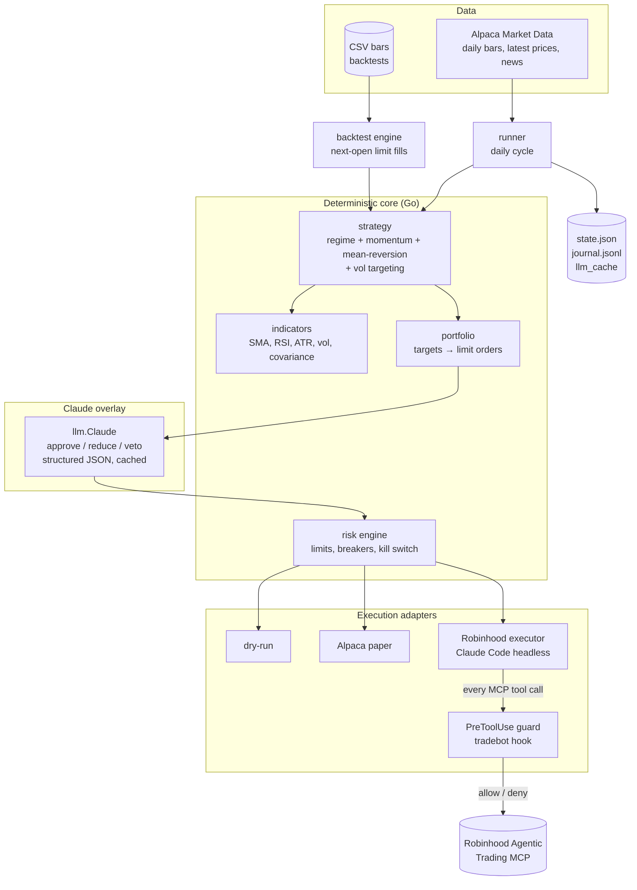
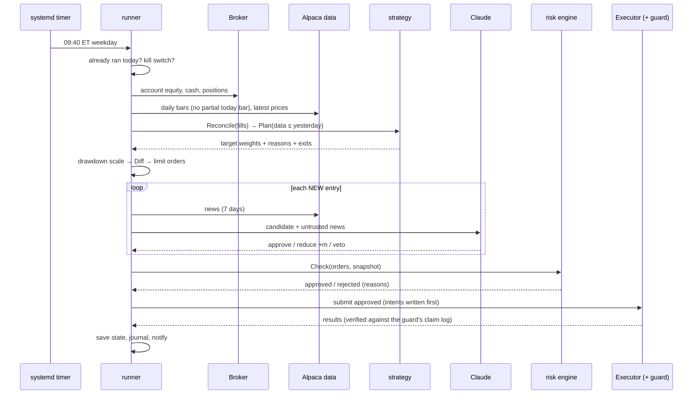

# tradebot: Architecture

A trading bot for a Robinhood agentic account with two modes: **swing** (`tradebot run`, daily, this document's main subject) and **intraday** (`tradebot day`, opening-range breakout, flat by the close; see [INTRADAY.md](INTRADAY.md)). A **deterministic, evidence-based strategy** decides the trades. **Claude** reviews each new entry and can only shrink or veto it. A **hard risk engine** has the final word. The same code runs in backtest, paper trading (Alpaca) and live trading (Robinhood).

> The strategy and its evidence are in [STRATEGY.md](STRATEGY.md). How to run everything is in [RUNBOOK.md](RUNBOOK.md).

---

## 1. Design principles

| # | Principle | What it means in the code |
|---|---|---|
| 1 | **Code decides, Claude reviews, risk enforces** | `strategy` produces targets. `llm` returns a multiplier clamped to [0, 1]. `risk` approves or rejects every order. |
| 2 | **Claude can only reduce risk** | `Verdict.Multiplier()` caps at 1.0, so a manipulated or wrong answer can at most skip a trade. |
| 3 | **Identical code paths** | `backtest.Run` and `runner.Run` call the same `strategy.Plan`, `portfolio.Diff` and `risk.Check`. |
| 4 | **No look-ahead** | Decisions see `data.Until(date)` only. A test perturbs future prices and asserts past fills don't change. |
| 5 | **Fail closed** | Stale data, an LLM error, an unknown MCP tool or a parse failure all mean no trade. |
| 6 | **Defense in depth for live money** | Five independent layers (§6). |
| 7 | **Everything auditable** | Append-only `journal.jsonl`, deterministic order IDs, and cached LLM decisions. |

## 2. Component diagram



## 3. The daily cycle

The bot runs **once per trading day at about 09:40 New York time**, using daily bars through the previous close. This matches the backtest exactly: decide at the close, fill at the next open.



## 4. Components

| Package | Responsibility | Key details |
|---|---|---|
| `internal/config` | YAML config plus defaults and validation | Rejects leverage (`max_gross_exposure > 1`) and sleeve weights summing above 1 |
| `internal/market` | `Bar`, `Series`, `Dataset`, `Until()` (the no-look-ahead view) | Dates are NY trading dates |
| `internal/indicators` | SMA, Wilder RSI/ATR, returns, realized vol, portfolio vol (covariance) | Bounded windows, so O(window) per call |
| `internal/strategy` | Regime filter, momentum sleeve, mean-reversion sleeve, vol targeting; persistent `State` | Pending entries confirmed or dropped by `Reconcile`; vetoes recorded by `MarkRejected` |
| `internal/portfolio` | Target weights to whole-share **limit** orders | Rebalance band, min notional, sells first, deterministic IDs `tb-YYYYMMDD-SYM-side` |
| `internal/risk` | Final gate: universe/deny list, limit-price sanity, position/gross/cash limits, no shorting, turnover, max orders, stale data, daily-loss and drawdown breakers, kill switch | Pure and deterministic; the file-based `HALT` switch works across processes |
| `internal/llm` | Claude entry reviewer | Structured output schema, cached system prompt, server-side refusal fallback, on-disk decision cache, untrusted news fenced and escaped |
| `internal/backtest` | Event-driven daily simulation, metrics, yearly table, parallel parameter sweep with in-sample/out-of-sample split | Limit orders fill at the next open with slippage, or at the limit if touched, otherwise they expire |
| `internal/alpaca` | Minimal REST client: daily/minute bars, latest trades, news, calendar, paper account/orders/status/cancel | Refuses non-paper trading URLs; retries reads (never order submissions) on 429/5xx |
| `internal/broker` | `DryRun`, `PaperSim`, `AlpacaPaper`, `Robinhood` (Claude Code executor), `RobinhoodNative` (direct MCP) | Order tracking/cancel (`Tracker`) for intraday; the native broker cancels only its own orders |
| `internal/intraday` | ORB engine (pure state machine), minute-bar backtester, live session loop | Same engine for backtest and live; Claude only before the open |
| `internal/lock` | Single-instance `flock` per state directory | Two overlapping runs can never double orders |
| `internal/hook` | Claude Code **PreToolUse guard** | Allows read-only tools and order calls matching a risk-approved intent (single use, 30-min expiry); denies everything else |
| `internal/runner` | One live/paper cycle, persistence, summary | Runs once per day unless `--force` |
| `internal/journal`, `internal/notify` | JSONL audit log; Slack-compatible webhook | none |

## 5. How Robinhood execution works (and why)

Robinhood's supported path for agents is its **Agentic Trading MCP server** (`https://agent.robinhood.com/mcp/trading`). It trades a separate, separately funded agentic sub-account. It is built for MCP clients like Claude Code, and authenticates with OAuth in the browser.

This bot uses **Claude Code in headless mode as the MCP client** (`claude -p ... --allowedTools mcp__robinhood-trading`). That gives an official, supported connection without reverse-engineering anything. An LLM in the execution path is a risk, so it is boxed in:

1. The Go core writes **order intents** (the risk-approved orders) to `state/robinhood/intents/current.json`, valid for 30 minutes.
2. The executor directory's `.claude/settings.json` installs a **PreToolUse hook** that runs `tradebot hook pretooluse` before *every* tool call. The hook:
   - denies any non-Robinhood tool (Bash, file writes, web, and so on);
   - denies deny-listed tools (transfer, withdraw, cancel, options, crypto, settings);
   - allows read-only tools (quotes, positions, balances);
   - allows an order tool **only** if the symbol and side match an unused intent, the share quantity is no larger, the limit price is no worse, it is a limit order, and no option or dollar-amount fields are present. The intent is claimed atomically (`O_EXCL`), so it can be used exactly once;
   - denies anything it cannot classify.
3. After the session, the runner **cross-checks** the executor's self-reported results against the guard's claim log. An order Claude claims it placed, but which the guard never allowed, is marked FAILED. A test run with a deliberately faulty executor confirmed this.
4. All intents are revoked when the run ends.

### 5.1 Native MCP client (implemented: `--broker robinhood-native`)

`internal/broker/rhnative.go` connects to the same Robinhood MCP server directly with the official Go MCP SDK. **There is no LLM in the order path.**
- **Login:**
  - OAuth is handled by the SDK: server discovery, dynamic client registration and PKCE.
  - `tradebot rh-login` runs the browser consent once. The refresh token is stored with 0600 permissions and refreshed automatically.
  - Headless runs never open a browser; they fail with instructions instead.
- **Tool mapping:** exact tool names and argument keys come from `tradebot rh-tools` and live in `robinhood.native` in the config. `tradebot doctor` checks that every configured tool exists.
- **Guard:** every order still passes the same guard (`hook.Evaluate`) in-process, so a config mistake cannot become a market order, an options order or a wrong size.
- **Cancels:** the broker only cancels orders that it placed itself in the same process.
- **Tests:** an in-memory MCP server (tool mapping, result parsing, the guard, cancel scoping) and a fake OAuth authorization server (full browser flow, token reuse, refresh and persistence).

This is **required for intraday trading**, because a Claude Code session takes 10–30 s per order. For swing trading either path works. The Claude Code executor stays available as a fallback.

## 6. Defense in depth (live money)

| Layer | Enforced by | Stops |
|---|---|---|
| 1. Funded-budget ceiling | Robinhood (separate agentic account) | Losing more than you deposited into the agentic account |
| 2. Strategy constraints | `strategy` | Illiquid names, sub-$5 stocks, oversized sleeves |
| 3. Claude overlay | `llm` (≤ 1× multiplier) | Entries into identifiable event risk (earnings, fraud, M&A pins) |
| 4. Risk engine | `risk` | Oversize, leverage, shorting, bad prices, stale data, loss streaks; drawdown kill switch |
| 5. Execution guard | `hook` | Any tool call other than exactly the approved orders |
| + Human | Robinhood push notification per trade, `tradebot halt`, one-tap disconnect in the app | Anything else |

## 7. Why this architecture

**Why a deterministic strategy with Claude as a reviewer, not "Claude picks stocks"?**
There is solid, decades-long evidence for trend/momentum and short-term mean reversion, and none for LLMs picking stocks over multi-week horizons. LLMs also **cannot be honestly backtested**: they have read about the historical period, so they know what happened. Keeping the alpha source deterministic makes the strategy testable. Giving Claude a narrow job it is actually good at (reading news for event risk) adds value without adding unmeasurable risk. And because Claude can only shrink positions, its worst failure mode is a missed trade.

**Why daily swing trading, not intraday?**
- Every Robinhood agentic order goes through an MCP round trip and a push notification, which doesn't suit high-frequency trading.
- Intraday strategies need the pattern-day-trader minimum on small accounts, tick data and low latency.
- Daily bars keep LLM costs to a few cents a day, and give robust, well-documented edges.

**Why Alpaca for data and paper trading?**
Robinhood has no paper-trading mode and no market-data API for agents. Alpaca's free tier provides split-adjusted daily history, live prices, news and a realistic paper account, so paper results are directly comparable.

**Why one code path for backtest and live?**
Most live-trading disasters come from differences between the research code and the production code. Here the backtester literally calls the production functions.

**Why limit orders only, whole shares only, sells first?**
- Limit orders bound slippage and make the guard's price check meaningful.
- Whole shares avoid fractional-order restrictions.
- Selling first frees cash so a buy never depends on margin.

## 8. Language choice: Go (not C++)

You asked for C++ "or any fast language". I chose **Go** after comparing the options against what actually limits this system:

| Criterion | C++ | Rust | **Go** |
|---|---|---|---|
| Raw compute speed | Fastest | ≈ C++ | ~1.5–3× C++ (still far more than needed) |
| Official Anthropic (Claude) SDK | ❌ none | ❌ none | ✅ `anthropic-sdk-go` |
| Official MCP SDK | ❌ | ✅ | ✅ (for the native Option A adapter) |
| Memory safety with real money | ❌ manual | ✅ | ✅ |
| HTTP/JSON/OAuth ergonomics | Painful | Good | Excellent (stdlib) |
| Concurrency for parameter sweeps | Threads | async/threads | Goroutines (trivial) |
| Deploy | Toolchain and ABI issues | Single binary | Single static binary |

**What actually limits speed here:** network calls (broker, data, Claude: 100 ms to 10 s each) and a once-a-day schedule. Compute is negligible. Measured in this repo:
- A 12-year, 43-symbol backtest runs in **~0.2 s**.
- The 81-combination walk-forward sweep (162 backtests) runs in **~6 s** (measured on a 4-core cloud sandbox).

C++ would save milliseconds on work that isn't the bottleneck, while making the Claude and HTTP integration hand-written and more error-prone. With real money, a correctness bug costs far more than milliseconds. Go gives compiled speed with official SDKs and memory safety.

## 9. State and files

```text
state/<broker>/
├── state.json          strategy sleeves, risk peak/day-start equity, last run date
├── journal.jsonl       every account snapshot, plan, verdict, order, rejection, guard decision
├── llm_cache/          Claude verdicts keyed by hash(model, prompt version, input)
├── intents/            Robinhood only: current.json + used/ claim markers
└── HALT                present = kill switch engaged (created by `tradebot halt` or the drawdown breaker)

state/intraday-<broker>/
├── intraday.json       day-trade counts, last session, risk state, positions left open at the last close
├── journal.jsonl       pre-market verdicts, stocks in play, every order/fill, session summary
└── HALT, lock, llm_cache/

state/robinhood-native/
├── oauth_token.json    OAuth client registration and refresh token (0600)
└── tools.json          last `tradebot rh-tools` output
```

Each broker keeps separate state (`state/dry-run`, `state/alpaca-paper`, `state/robinhood`), so paper and live never interfere.

## 10. Known limitations

- **Survivorship bias:** the default universe is today's large caps, which inflates backtests. See STRATEGY.md §6.
- **The Robinhood MCP tool names and schemas are not public.** Run `tradebot rh-tools` and map them in `robinhood.native` (and the guard keywords) before going live. Unknown tools are denied until then.
- **With the Claude Code executor, account data is transcribed by Claude.** The runner checks it for plausibility. The native broker reads it directly.
- **Intraday data:** free real-time Alpaca quotes are IEX-only and can lag. See INTRADAY.md §3.
- **No earnings calendar yet:** Claude infers imminent earnings from news. A deterministic blackout is in the completion prompt.
